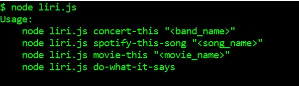
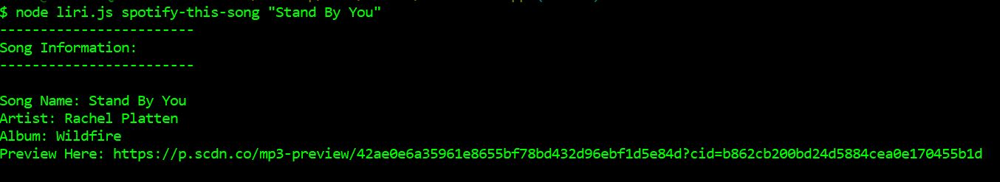
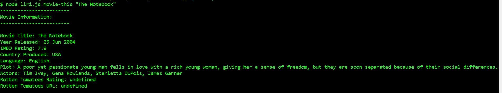
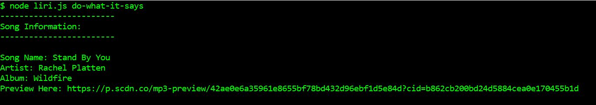

# LIRI NODE APP
LIRI is like iPhone's SIRI. However, while SIRI is a Speech Interpretation and Recognition Interface, LIRI is a Language Interpretation and Recognition Interface. LIRI will be a command line node app that takes in parameters and gives you back data.

### PROJECT DESCRIPTION

LIRI searches Spotify for songs, Bands in Town for concerts, and OMDB for movies using user's input via the following command lines:
* `node liri.js concert-this <artist/band name here>`
* `node liri.js spotify-this-song '<song name here>`
* `node liri.js movie-this '<movie name here>`
* `node liri.js do-what-it-says`

In addition to logging the data to the terminal/bash window, the data is outputed to a .txt file called log.txt.

##### Bands In Town

`node liri.js concert-this <artist/band name here>`

* Name of the venue
* Venue location
* Date of the Event (use moment to format this as "MM/DD/YYYY")

##### Spotify

`node liri.js spotify-this-song '<song name here>`

* Artist(s)
* The song's name
* A preview link of the song from Spotify
* The album that the song is from
* If no song is provided then the program will default to "The Sign" by Ace of Base.

##### Movie

`node liri.js movie-this '<movie name here>`

* Title of the movie.
* Year the movie came out.
* IMDB Rating of the movie.
* Rotten Tomatoes Rating of the movie.
* Country where the movie was produced.
* Language of the movie.
* Plot of the movie.
* Actors in the movie.
* If the user doesn't type a movie in, the program will output data for the movie 'Mr. Nobody.'

##### Do-What-It-Says

`node liri.js do-what-it-says`

* It runs spotify-this-song for "I Want it That Way," as follows the text in random.txt.

### TECHNOLOGIES USED

* Node.js
* NPM packages (Bandsintown, Axios, FS, Spotify, OMDB, Moment)
* Javacript
* API (bandsintown, spotify, OMDB)

